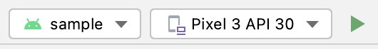

# 🏄‍ Sample app

### Install

* Clone repository https://github.com/Blade-Labs/kotlin-blade
* Open in Android studio
* Run `sample` on your device or emulator

### Video

### App structure

Demo app uses BottomNavigationView with 3 tabs, loading different fragments. 
Every fragment have controls and output section. In output section app shows serialized result of method call and execution time.

On Init fragment there are fields for Blade SDK init and some demo data like testnet account, private key, token id and contract id.
This data temporary stores in Config object singleton. 

In every fragment on `onViewCreated` method calling `Blade.getInfo()` to check if SDK initialized and enable or disable controls

As `Blade` object is singleton it may be initialized once and use in every other fragment. 

### Explore app

#### Init

* Blade SDK init data
* Demo account, contract id, token id, message for signature verification
* Init and Stop buttons

#### Examples

* Get balance - getting balance of account id from field (preset from init page)
* Get transactions - getting transactions of account id
* Create account - create new account through Blade API, using config of current dAppCode
* Delete account - after creating account - new account data preseted and may be deleted
* From mnemonic - getting ECDSA keys from field `Mnemonic / Message / Signature`
* Sign - getting signature from field `Mnemonic / Message / Signature`. Mind that on verification, message will be used from `Init` screen 
* Verify - verifying signature using public key and message from `Init` screen from field `Mnemonic / Message / Signature`. 
* Contract call - calling contractId (from `Init` screen) function `set_message` - setting string from field `Mnemonic / Message / Signature` 
* Contact query - querying function `get_message` and get message that we set with timestamp, and it's length
* Send HBARs - sending amount HBARs to receiver id  
* Send tokens - sending amount tokens (from `Init` screen) to receiver id

#### Exchange

* Strategy `Buy`, `Sell` or `Swap`
* Get quotes - getting quotes for `strategy`, `source code`, `amount` and `target code`
* Service - after getting quote, you can pick one of the services, and press enabled button 
* `Buy`, `Sell` buttons - getting configured url, and open in browser
* `Swap` button - call swap contract